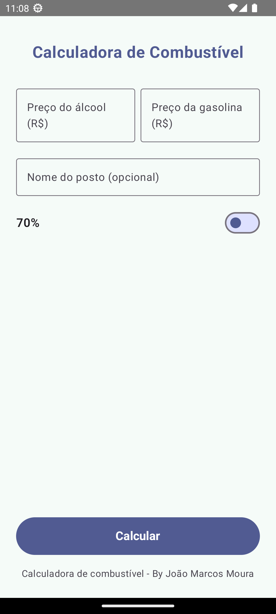
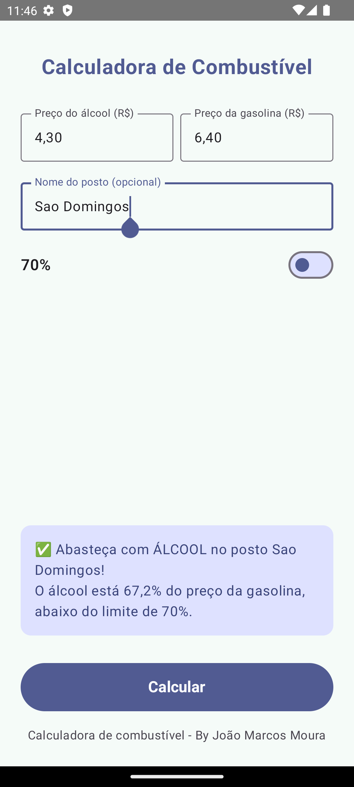

# Calculadora de Combustível

Aplicativo Android desenvolvido em Kotlin com Jetpack Compose para ajudar motoristas a decidir entre álcool e gasolina com base no preço praticado em cada posto.

## Visão Geral
- O cálculo compara os preços informados e aplica automaticamente a regra dos 70% ou 75%, de acordo com o seletor na interface.
- O valor do seletor (70% ↔ 75%) e os campos preenchidos são preservados com `rememberSaveable`, garantindo que a escolha resista a rotações e recriações de atividade.
- Interface construída com Material 3, paleta customizada para modo claro/escuro e layout refinado (spacing, cards e controles responsivos).
- Ícone próprio distribuído em todos os diretórios `mipmap`, diferenciando o app da versão de referência do professor.

## Funcionalidades
- **Cálculo dinâmico**: converte valores com formatação BR (`NumberFormat`) e decide automaticamente o melhor combustível.
- **Seletor de limiar**: `Switch` alterna entre 70% e 75%; ao mudar, o cálculo utiliza o novo percentual instantaneamente.
- **Feedback contextualizado**: mensagem final traz emoji, combustível recomendado e, se informado, o nome do posto.
- **Persistência de estado**: inputs e seleção sobrevivem a reconfigurações graças ao uso de `rememberSaveable`.
- **Tema refinado**: novas cores para claro/escuro (`PrimaryLight/Dark`, `SecondaryLight/Dark`, etc.) e componentes estilizados.

## Demonstração em Vídeo
[▶️ Assista ao vídeo](previews/Preview_APP_Video.mp4)

## Pré-visualizações





## Stack e Ferramentas
- Kotlin 2.0.21
- Jetpack Compose (Material 3 + BOM 2024.09.00)
- Android Gradle Plugin 8.13.0
- Minimum SDK 24 | Target SDK 36

## Como Executar
1. Requisitos: Android Studio Jellyfish | Koala ou superior, SDK 24+, JDK 11.
2. Clone ou faça download do projeto.
3. Abra o diretório na IDE e aguarde a sincronização do Gradle.
4. Execute em um dispositivo/emulador com `Run > Run 'app'` ou use a linha de comando:

```bash
./gradlew assembleDebug
```

O APK gerado estará em `app/build/outputs/apk/debug/`.

## Estrutura
```
CalculadoradeCombustivel/
├── app/src/main/java/org/pdm/calculadoradecombustivel/MainActivity.kt
├── app/src/main/java/org/pdm/calculadoradecombustivel/ui/theme/{Color,Theme,Type}.kt
├── app/src/main/res/mipmap-*/ic_launcher*.webp
└── previews/Preview_APP_*.png
```

> Este projeto foi desenvolvido durante a cadeira de Programação para Dispositivos Móveis (2025.2) do curso de SMD da UFC.

## Avaliação

### 1. Salvar e restaurar o estado do Switch (0,5 pt)
O app persiste a opção 70%/75% com Jetpack DataStore: o `LaunchedEffect` restaura o valor salvo e o callback do `Switch` grava novas escolhas. Trecho em `app/src/main/java/org/pdm/calculadoradecombustivel/MainActivity.kt`:

```kotlin
LaunchedEffect(dataStore) {
    dataStore.data.collectLatest { preferences ->
        val storedUse75 = preferences[FuelPreferencesKeys.use75Percent] ?: false
        if (use75Percent != storedUse75) {
            use75Percent = storedUse75
        }
    }
}

onSwitchChange = { checked ->
    use75Percent = checked
    coroutineScope.launch {
        dataStore.edit { prefs ->
            prefs[FuelPreferencesKeys.use75Percent] = checked
        }
    }
}
```

### 2. CRUD de valores de combustível (2,5 pt)
`GasStation` é salvo, editado e excluído mantendo até 10 registros. A lista em memória reflete o armazenamento (JSON dentro do DataStore, que cumpre o papel requisitado para SharedPreferences). Principais funções em `MainActivity.kt`:

```kotlin
val savedStations = remember { mutableStateListOf<GasStation>() }

fun persistStations() {
    dataStore.edit { prefs ->
        prefs[FuelPreferencesKeys.stations] = savedStations.toJsonStorage()
    }
}

fun saveStation() { /* validação, add/update + persistStations() */ }

fun startEditing(station: GasStation) { /* carrega dados no formulário */ }

fun deleteStation(station: GasStation) {
    savedStations.removeAt(index)
    persistStations()
}
```

### 3. Lista de postos com detalhes (3 pt)
`StationListScreen` renderiza uma `LazyColumn` com nome, valores e ações para editar/excluir. Ao tocar, abre diálogo para mapa ou edição. Código em `app/src/main/java/org/pdm/calculadoradecombustivel/StationListScreen.kt`:

```kotlin
LazyColumn(...) {
    items(stations, key = { it.id }) { station ->
        Card(Modifier.clickable { onStationClick(station) }) {
            Text(text = station.name)
            Text(text = stringResource(R.string.list_alcohol_price, formatCurrencyBR(station.alcoholPrice)))
            Text(text = stringResource(R.string.list_gasoline_price, formatCurrencyBR(station.gasolinePrice)))
            IconButton(onClick = { onEdit(station) }) { ... }
            IconButton(onClick = { onDelete(station) }) { ... }
        }
    }
}
```

### 4. Localização e exibição no mapa (2 pt)
`MainActivity.kt` solicita permissão, usa `FusedLocationProviderClient` para capturar a latitude/longitude e oferece Intent para abrir o posto no Maps:

```kotlin
val permissionLauncher = rememberLauncherForActivityResult(RequestPermission()) { isGranted ->
    if (isGranted) requestCurrentLocation() else showLocationError(...)
}

@RequiresPermission(...) fun requestCurrentLocation() {
    fusedLocationClient.getCurrentLocation(...).addOnSuccessListener { location ->
        updateLocationFromCoordinates(location.latitude, location.longitude)
    }
}

fun openStationInMaps(station: GasStation) {
    val geoUri = "geo:0,0?q=${Uri.encode(locationText)}".toUri()
    context.startActivity(Intent(Intent.ACTION_VIEW, geoUri))
}
```

### 5. Suporte a internacionalização (2 pt)
Há dois conjuntos de strings localizadas (`values/strings.xml` e `values-en/strings.xml`), cobrindo todo o texto exibido:

```xml
<!-- values/strings.xml -->
<string name="home_title">Calculadora de Combustível</string>

<!-- values-en/strings.xml -->
<string name="home_title">Fuel Calculator</string>
```

As traduções são aplicadas automaticamente via `stringResource(...)`, respeitando o idioma configurado no sistema.

Além disso, o app segue boas práticas completas de i18n:

- **Nenhum texto hard-coded** nos Composables — todo conteúdo textual encontra-se em recursos traduzíveis.
- **Formatação numérica compatível com região**, utilizando `NumberFormat.getInstance(Locale.getDefault())` para garantir separador decimal correto em cada idioma.
- **Arquitetura preparada para novas traduções**, permitindo adicionar facilmente `values-es/`, `values-fr/` e outros idiomas sem alterar o código.
- **Suporte natural à mudança de idioma do sistema**: ao trocar a linguagem no Android, o Compose recompõe a interface e exibe a tradução correspondente.
